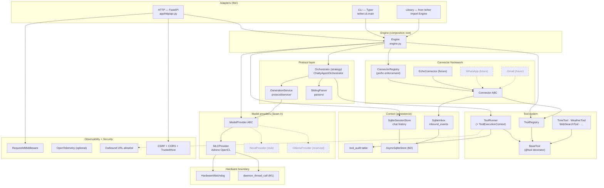
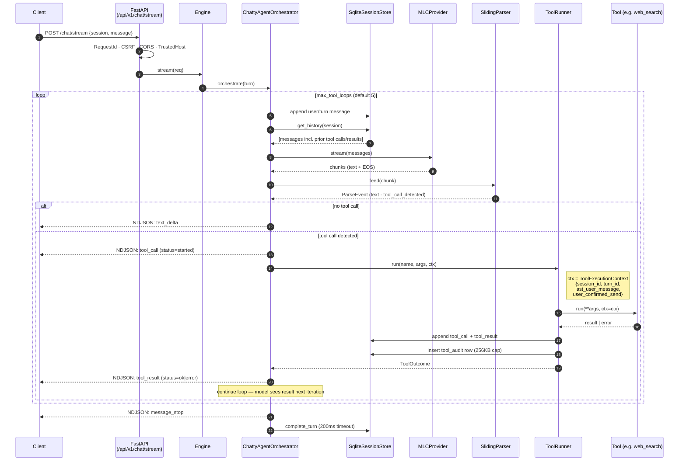
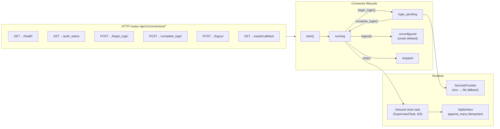
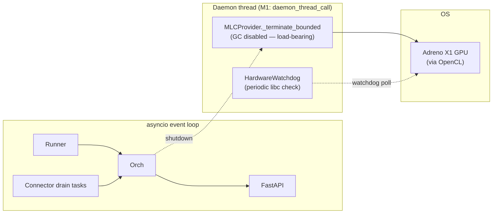
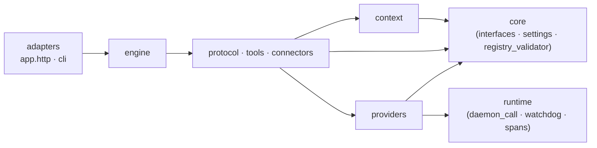

# Tether — Architecture

> Post-Phase-8 architecture. This is the **living map** for new contributors and AI agents.
> Binding contract lives in `files/investigations/_synthesis.md` (session-state).

Tether is a single-user, local-first FastAPI service that streams chat completions from
on-device LLMs (currently MLC-LLM on Snapdragon X Elite Adreno GPU) with first-class
function calling, persistent session history, and a connector framework for inbound-read /
outbound-send personal data integrations.

The architecture is **library-first**: HTTP, CLI, and (future) GUI are thin adapters over a
single `Engine` composition root. Anyone can `from tether import Engine` and bypass HTTP.

---

## 1. Layered overview



Solid arrows = wired today. Dashed/grayed = scaffolded seams (no runtime impl).

---

## 2. Request lifecycle (a single chat turn)



**Streaming envelope (v2 default)**: `message_start` → N×(`text_delta` | `tool_call` | `tool_result`) → `message_stop`.
Legacy v0 envelope (`text` / `tool_started` / etc.) available via `Accept: application/x-ndjson; version=0` until deprecation.

**Cancel-path budgets** (synthesis §3.5): tool-grace 250ms, persist budget 200ms on
`_audit_tool_call` and `complete_turn` so a slow store can't block client cancellation.

---

## 3. Extension seams (synthesis §12)

These are the four pre-engineered pluggability points. Each is an ABC plus a default
implementation; adding a second impl is a config change + one new class.

| Seam | Where | What | Status |
|---|---|---|---|
| **A — ModelProvider** | `providers/types.py::ModelProvider` | Swap inference backend. Default: `MLCProvider`. Future: `NexaProvider` (NPU), `OllamaProvider` (reserved). | ✅ ABC live; MLC impl + Nexa stub |
| **B — Orchestrator strategy** | `protocol/orchestration/types.py::Orchestrator` | Swap conversation policy. Default: `ChattyAgentOrchestrator` (ReAct-style chatty loop). Future: Ralph Loop / Notebook of Atomic Facts (small-context strategy). Selected via `mode` field on `StreamRequest` + per-session state. | ✅ ABC live; one impl |
| **C — Practical context window** | `providers/types.py::get_practical_context_window(model_name, ram_budget_gb)` | Per-provider RAM-aware effective context. Used to clamp history before send. | ✅ ABC live; MLC impl with KV-cache math |
| **D — Per-provider parser** | `protocol/parsers/types.py::Parser` | Per-provider tool-call detection. MLC: `<<function_call>>` marker (`SlidingParser`). Future: provider-native function-call schemas (Ollama JSON mode, NexaSDK OpenAI-compat). System prompt lives under `providers.<id>.args.system_prompt` so parsers and prompts ship together. | ✅ ABC live; one impl |

---

## 4. Connector framework (Phase 4.5; foundation for WhatsApp/Gmail)

Connectors are first-class extensions for personal-data integrations. They appear to the
model as **regular tools** (with mandatory `{connector_id}_` prefix) but additionally
publish an **inbound stream** of events (DMs, emails, etc.) to `SqliteInbox`.



**Send-safety pattern** (synthesis §4 footer): every outbound-send tool exposes
`*_prepare_send` (returns a draft id) and `*_confirm_send` (consults
`ToolExecutionContext.user_confirmed_send`). Tools never auto-send; the model is forced
to elicit explicit user confirmation. This is why `ToolExecutionContext` exists — tools
have no turn awareness on their own.

**Test fixture**: `tests/fixtures/echo_connector.py::EchoConnector` exercises every
contract (`list[str]` arg, `Optional[T]` arg, confirm-send tool, inbound stream).

---

## 5. Data layout

```
data/
├── tether.db                        # single SQLite (WAL)
│   ├── sessions                     # session_id, created_at, …
│   ├── messages                     # session_id, turn_id, role, content, …
│   ├── inbound_events               # connector_id, payload, seen, …
│   ├── tool_audit                   # tool calls + results (256 KB cap)
│   └── _yoyo_*                      # yoyo-migrations metadata
├── connectors/<id>/                 # per-connector private state
└── secrets/                         # file-based fallback for SecretsProvider

models/                              # MLC model dirs + compiled libs
├── libs/                            # *-adreno.dll, *-cpu.dll
├── Qwen3-4B-q4f16_0-MLC/            # weights + mlc-chat-config.json
└── …
```

`models_root` is configurable via `TETHER_MODELS_DIR` env var; defaults to `models`.
Formerly `dist/` (renamed in Phase 8 step 85 — the old name implied build artifacts).

---

## 6. Concurrency + hardware boundary



**Critical invariant**: `gc.disable()` inside the MLC shutdown daemon thread is
**load-bearing**. Re-enabling it deadlocks Qwen2.5-7B on Ctrl+C (smaller `prefill_chunk_size`
exposes a destructor hang). Enforced by the comment in `daemon_thread_call` and a
codebase rule. See `docs/runbooks/SHUTDOWN_HANG_FIX_SUMMARY.md` (post-Phase-8).

---

## 7. Module-graph dependency rules



**Dependency direction is one-way.** Higher layers depend on lower; never the reverse.
- `core` is the foundation; nothing under `core/` depends on anything else in `tether/`.
- `runtime` is hardware-adjacent; only `providers` may depend on it.
- `protocol`, `tools`, `connectors` may depend on `context` + `providers` + `core`.
- `engine` wires everything; `adapters` only see `engine` and serialization types.

---

## 8. Six shared modules (synthesis §13.4)

These exist to dedup logic and keep the layering honest:

| ID | Path | Purpose | Used by |
|---|---|---|---|
| **M1** | `runtime/daemon_call.py::daemon_thread_call` | GC-disabled daemon thread for blocking native cleanup | HardwareWatchdog · MLC `_terminate_bounded` · future native-cleanup connectors |
| **M2** | `context/_async_sqlite_base.py::AsyncSqliteStore` | aiosqlite + WAL + yoyo-migrations base | SqliteSessionStore · SqliteInbox |
| **M3** | `runtime/task_supervisor.py::SupervisedTask` | structured-concurrency wrapper for long-running tasks | Connector drain tasks · future Gmail polling |
| **M4** | `runtime/spans.py::async_span` | structlog span helper | tool spans · provider spans · connector spans |
| **M5** | `core/registry_validator.py::validate_unique_names` | uniqueness + forbidden-name + required-prefix checks at boot | ToolRegistry · ConnectorRegistry |
| **M6** | `config/_strict.py::StrictModel` | Pydantic base with `extra='forbid'` and frozen | every Settings sub-model (~12) |

---

## 9. Frozen / locked decisions (don't relitigate)

Authoritative: synthesis §3 + §10–§13. Quick-reference here:

- **Single-user, local-only.** No multi-tenant, no cloud auth, no plugin SDK.
- **Drop-and-rebuild** chat history at schema cutover (no migration tools needed).
- **`LoopLimitPolicy`** = `EMIT_LIMIT_EVENT` (default).
- **`ToolErrorPolicy`** = `FEED_BACK_TO_MODEL` (tool errors no longer break the loop).
- **Hardware backend** = Adreno X1 GPU via OpenCL — never call it "NPU". (NPU is reserved for the future `NexaProvider`, Seam A.)
- **Runtime** = Qualcomm CodeLinaro MLC-LLM `2025.06.r1` (Prism-emulated x64 Python 3.12).
- **GC-disable in MLC shutdown daemon thread** = load-bearing.
- **`tether_service` import alias** = backward-compat for one release cycle; deletion deferred.
- **Frozen paths**: pre-refactor reference code (`llm_service/`, `legacy/`) is archived at the [`archive/pre-refactor`](https://github.com/Lando-00/Tether/tree/archive/pre-refactor) branch. Reference there if you need to understand pre-refactor behavior; never bring it back into `main`.
- **No forbidden features**: autonomous reply, scheduled jobs, push, voice, Canvas, multi-agent routing, plugin manifests.

---

## 10. Pointers

- **Binding plan**: `files/investigations/_synthesis.md` (session-state, ~125 KB, 13 sections).
- **Live execution status**: `RESUME.md` (session-state).
- **Per-todo state**: SQL `todos` table.
- **Sub-agent prompt templates**: `.github/agents/` (`implementation.agent.md`, `code-review.agent.md`).
- **Repository conventions**: `.github/copilot-instructions.md`.
- **Connector contract**: synthesis §10 (integrated from a parallel planning session).
